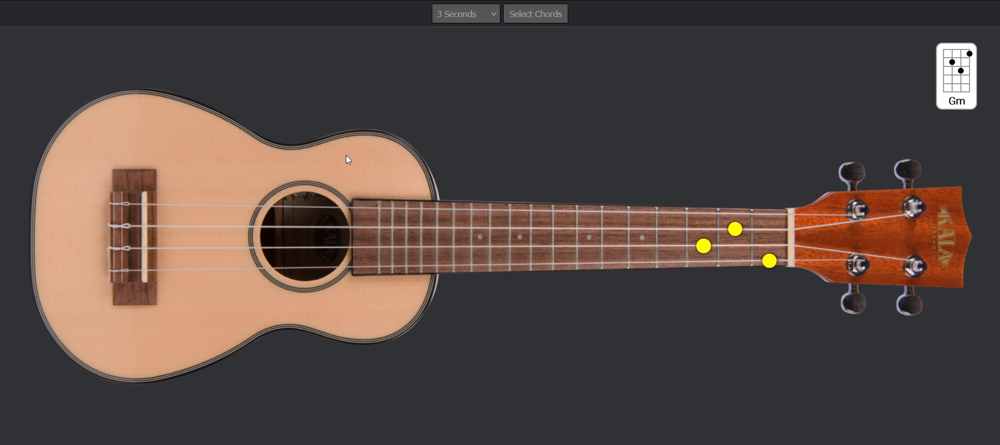

# Ukulele Chord Trainer

This simple tool was created so I could learn the basic chords for a Ukulele. It's aimed at beginners, however, I will likely add more chords if I need them, or if requested.

There is an option to set the speed of the chord change, and also an option to select which chords you would like to practice.

<https://popthosepringles.github.io/Ukulele-Chord-Trainer/>
